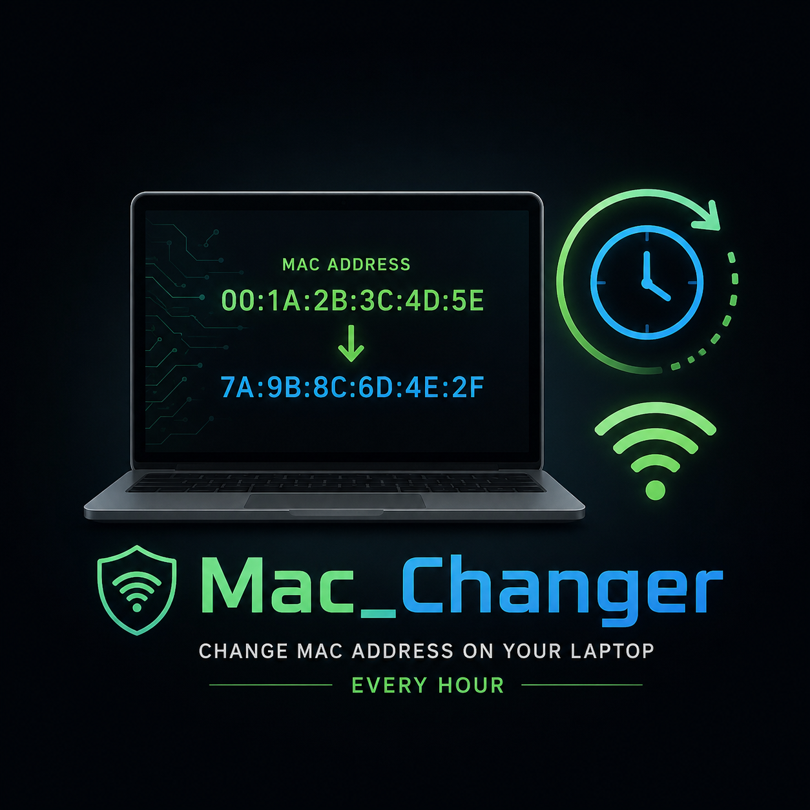

# MAC Changer - Hourly Randomizer with Jitter

<p align="center">
  
</p>


**A lightweight, privacy-focused Linux tool that automatically randomizes your network interface MAC addresses every hour with built-in jitter (random delay) and full execution timestamps.**

Designed for users who want to reduce local network tracking while avoiding predictable change patterns.

## Features

- Randomizes MAC addresses on Ethernet (`eno1`) and Wi-Fi (`wlp4s0`) interfaces
- **Jitter support**: Random delay between 1–59 minutes before changing MACs (makes timing unpredictable)
- Script execution timestamps logged for every run (start, jitter sleep, changes, completion)
- Automatic Wi-Fi reconnection using NetworkManager (`nmcli`)
- Detailed logging to `/var/log/macchange.log`
- Safe to run as root via **cron** or **systemd timer**
- Easy to customize interfaces, delay range, and Wi-Fi behavior

## Why Add Jitter and Timestamps?

- **Jitter** prevents attackers or network operators from correlating your activity to exact hourly changes.
- **Timestamps** provide a clear audit trail so you can see exactly when changes occurred and troubleshoot any issues.

## Prerequisites

- Linux (Ubuntu 24.04+ / Debian-based recommended)
- `macchanger` package
- `NetworkManager` (for Wi-Fi auto-reconnect)

```bash
sudo apt update && sudo apt install macchanger
```

## Installation

1. Clone the repository:

   ```bash
   git clone https://github.com/yourusername/mac-changer-hourly.git
   cd mac-changer-hourly
   ```

2. Install the script:

   ```bash
   sudo cp macchange.sh /usr/local/bin/macchange.sh
   sudo chown root:root /usr/local/bin/macchange.sh
   sudo chmod 755 /usr/local/bin/macchange.sh
   ```

3. Create and secure the log file:

   ```bash
   sudo touch /var/log/macchange.log
   sudo chmod 640 /var/log/macchange.log
   sudo chgrp adm /var/log/macchange.log 2>/dev/null || true
   ```

## Automation Options

### Option 1: Cron (Simple, with built-in jitter)

Edit root's crontab:

```bash
sudo crontab -e
```

Add this line:

```cron
0 * * * * /usr/local/bin/macchange.sh
```

The script handles the random jitter internally, so changes will not happen at the top of the hour.

### Option 2: Systemd Timer + Service (Recommended)

This method gives you better integration with `journalctl`, automatic error handling, and persistent timers.

See the `systemd/` directory in this repository for ready-to-use unit files, or follow these steps:

1. Copy the unit files:

   ```bash
   sudo cp systemd/macchange.service /etc/systemd/system/
   sudo cp systemd/macchange.timer /etc/systemd/system/
   ```

2. Enable and start:

   ```bash
   sudo systemctl daemon-reload
   sudo systemctl enable --now macchange.timer
   ```

3. Check status:

   ```bash
   systemctl status macchange.timer
   journalctl -u macchange.service -f
   ```

## Manual Testing

Run the script manually:

```bash
sudo macchange.sh
```

View the last 30 log entries:

```bash
sudo tail -n 30 /var/log/macchange.log
```

## What the Script Does

1. Logs the start time with a full timestamp
2. Sleeps for a random duration (jitter: 60–3540 seconds)
3. For each configured interface:
   - Brings the interface down
   - Changes the MAC address using `macchanger -r`
   - Brings the interface back up
4. Reconnects Wi-Fi using `nmcli` (if the Wi-Fi interface is configured)
5. Logs completion with timestamps and before/after MAC addresses

## Customization

Edit `/usr/local/bin/macchange.sh` and modify the variables near the top of the file:

```bash
INTERFACES=("eno1" "wlp4s0")     # Add or remove interfaces here
MIN_JITTER=60                    # Minimum delay in seconds (1 minute)
MAX_JITTER=3540                  # Maximum delay in seconds (59 minutes)
WIFI_INTERFACE="wlp4s0"          # Used for nmcli reconnect
LOG_FILE="/var/log/macchange.log"
```

## MAC Spoofing Risks and Important Notes

**Please read before deploying**

While MAC address randomization is a useful privacy tool, it comes with trade-offs:

- Some networks (corporate, enterprise, hotel, or paid public Wi-Fi) actively detect and block devices using randomized MAC addresses.
- Frequent changes can trigger security alerts, captive portal loops, or temporary loss of connectivity.
- On systems where NetworkManager or systemd already performs MAC randomization, you may experience conflicts.
- Certain routers and access points log MAC address changes as suspicious behavior.
- **Legal & Policy Compliance**: MAC spoofing is generally legal for personal privacy in most jurisdictions, but it may violate your network provider’s acceptable use policy or terms of service. Use responsibly and only on networks where you have authorization.

**Best Practice Recommendation**:
Test thoroughly on your home or trusted networks first. Consider using this tool primarily for privacy on personal connections rather than high-security or monitored environments.

## Log Format Example

```
[2026-07-09 14:12:03] === MAC Changer started ===
[2026-07-09 14:12:03] Applying jitter: sleeping for 2174 seconds...
[2026-07-09 14:48:17] Changing MAC on eno1...
[2026-07-09 14:48:18]   Old: 00:11:22:33:44:55 → New: a1:b2:c3:d4:e5:f6
[2026-07-09 14:48:19] Changing MAC on wlp4s0...
[2026-07-09 14:48:20]   Old: 66:77:88:99:aa:bb → New: 11:22:33:44:55:66
[2026-07-09 14:48:22] Reconnecting Wi-Fi...
[2026-07-09 14:48:25] === MAC Changer completed successfully ===
```

## License

MIT License

Free to use, modify, and distribute. Made for privacy-conscious users who want to rotate responsibly.

---

**Privacy through controlled, unpredictable rotation.**
